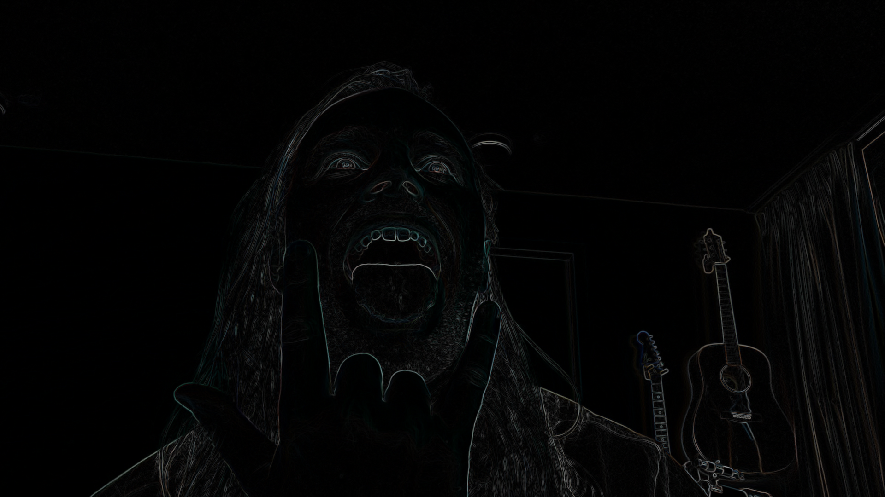

# Real-time Camera Filter

A PyTorch-based video processing pipeline for applying Sobel edge detection to video files and webcam streams. Designed for real-time performance with GPU acceleration support.


*Real-time edge detection with `--blur 3 --threshold 0.0`*

## Features

- **Real-time webcam processing** with live edge detection preview
- **Video file processing** with audio preservation
- **GPU acceleration** via PyTorch (CUDA support)
- **Adjustable parameters** for edge detection sensitivity and smoothing
- **Modular architecture** - easy to extend with custom filters
- Command-line interface for both webcam and video processing

## Installation

### Prerequisites

- Python 3.12 or higher
- ffmpeg (for audio processing)

### Setup

1. Clone the repository:
```bash
git clone https://github.com/xblaauw/realtime_camera_filter
cd realtime_camera_filter
```

2. Create get correct python version, create .venv & install dependencies using `uv`:
```bash
uv sync
```

## Usage

### Webcam Processing

Process your webcam feed in real-time with Sobel edge detection:

```bash
python webcam.py [camera_id] [--threshold THRESHOLD] [--blur BLUR]
```

**Examples:**
```bash
# Use default settings (camera 0, threshold=0.03, blur=7)
python webcam.py

# Use camera 1 with more forgiving edge detection
python webcam.py 1 --threshold 0.02 --blur 9

# Sharper edges, less smoothing
python webcam.py 0 --threshold 0.1 --blur 3
```

**Controls:**
- Press `q` to quit the preview window

**Parameters:**
- `camera_id`: Webcam device ID (default: 0)
- `--threshold`: Edge detection threshold (0.0-1.0). Lower = more edges (default: 0.03)
- `--blur`: Gaussian blur kernel size (odd number). Higher = smoother edges (default: 7)

### Video File Processing

Process video files while preserving audio:

```bash
python process_input.py INPUT_VIDEO [OUTPUT_VIDEO] [options]
```

**Examples:**
```bash
# Process with auto-generated output name
python process_input.py input/video.mp4

# Custom output location
python process_input.py input/video.mp4 output/edges.mp4

# Custom edge detection settings
python process_input.py input/video.mp4 --threshold 0.05 --blur 5

# Show preview while processing
python process_input.py input/video.mp4 --preview

# Process without preserving audio
python process_input.py input/video.mp4 --no-audio
```

**Parameters:**
- `INPUT_VIDEO`: Path to input video file (required)
- `OUTPUT_VIDEO`: Path to output video file (optional, defaults to `output/edge_<input_name>`)
- `--threshold`: Edge detection threshold (0.0-1.0). Lower = more edges (default: 0.03)
- `--blur`: Gaussian blur kernel size (odd number). Higher = smoother edges (default: 7)
- `--preview`: Show real-time preview during processing
- `--no-audio`: Don't preserve audio from source video

## Project Structure

```
realtime_camera_filter/
├── pipeline.py           # Core pipeline and filter classes
├── webcam.py             # Webcam processing script
├── process_input.py      # Video file processing script
├── main.py               # Legacy main script (can be used as reference)
├── input/                # Place input videos here
├── output/               # Processed videos saved here
├── examples/             # Example screenshots
└── README.md             # This file
```

## How It Works

### Sobel Edge Detection

The pipeline uses Sobel operators to detect edges in images:

1. **Gaussian Blur** (optional): Reduces noise and smooths the image
2. **Sobel Kernels**: Convolutional kernels detect horizontal and vertical gradients
3. **Gradient Magnitude**: Combines X and Y gradients: `sqrt(Gx² + Gy²)`
4. **Thresholding**: Filters out weak edges below the threshold

### Architecture

The modular design separates concerns:

- **`SobelEdgeFilter`**: PyTorch-based edge detection filter
- **`VideoSource`**: Abstract base for video sources
  - **`VideoFileSource`**: Reads MP4/video files
  - **`WebcamSource`**: Captures from webcam
- **`VideoPipeline`**: Processes frames through filters
  - `process_to_file()`: For video files (preserves audio)
  - `process_realtime()`: For live webcam streams

### Adding Custom Filters

To create your own filter:

1. Create a new filter class following the `SobelEdgeFilter` pattern
2. Implement an `apply(frame: np.ndarray) -> np.ndarray` method
3. Pass your filter to `VideoPipeline` instead of `SobelEdgeFilter`

Example:
```python
class MyCustomFilter:
    def apply(self, frame: np.ndarray) -> np.ndarray:
        # Your processing logic here
        return processed_frame

# Use it
filter_obj = MyCustomFilter()
source = WebcamSource(0)
pipeline = VideoPipeline(source, filter_obj)
pipeline.process_realtime()
```

## Performance

- **GPU Acceleration**: Automatically uses CUDA if available
- **Real-time Processing**: Optimized for 30+ FPS on modern hardware
- **Memory Efficient**: Processes frames individually, no full video loading

## Tuning Parameters

### For More Edges (More Forgiving)
- **Lower threshold**: `--threshold 0.01` to `0.03`
- **Higher blur**: `--blur 7` to `11`

### For Fewer Edges (More Selective)
- **Higher threshold**: `--threshold 0.1` to `0.2`
- **Lower blur**: `--blur 3` to `5`

### For Noisy Input (Webcams, Low Quality)
- **Increase blur**: `--blur 9` to `13`
- **Adjust threshold**: Experiment with `0.03` to `0.08`

## Requirements

- `torch >= 2.9.1`
- `torchvision >= 0.24.1`
- `opencv-python >= 4.12.0`
- `numpy >= 2.2.6`
- `ffmpeg` (system package for audio handling)

## Examples

### Webcam with DroidCam
Works seamlessly with virtual camera apps like DroidCam:
```bash
python webcam.py 0 --threshold 0.03 --blur 7
```

### Batch Processing
Process multiple videos:
```bash
for video in input/*.mp4; do
    python process_input.py "$video" --threshold 0.05
done
```

## License

MIT License - feel free to use and modify as needed.

## Contributing

Contributions welcome! Feel free to:
- Add new filters
- Improve performance
- Add features (e.g., output to virtual camera, different edge detection algorithms)
- Fix bugs

## Troubleshooting

**Q: Webcam not working?**
- Check camera ID with `ls /dev/video*` (Linux) or try different IDs
- Ensure no other application is using the webcam

**Q: Audio not preserved?**
- Ensure ffmpeg is installed: `ffmpeg -version`
- Check source video has audio: `ffprobe input.mp4`

**Q: Slow performance?**
- Check if CUDA is available: `python -c "import torch; print(torch.cuda.is_available())"`
- Reduce blur kernel size
- Lower input resolution (modify source before processing)

**Q: Too many/few edges?**
- Adjust `--threshold`: Lower for more edges, higher for fewer
- Adjust `--blur`: Higher for smoother/more forgiving detection

## Acknowledgments

Built with PyTorch, OpenCV, and ffmpeg.
